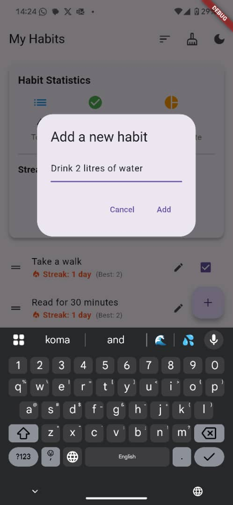
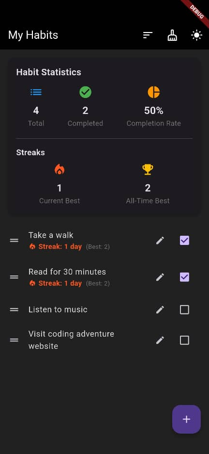
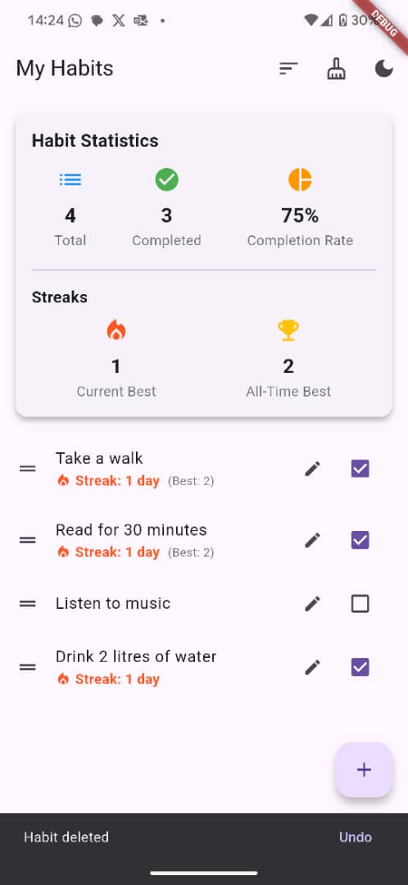

# Habit Tracker App

A Flutter application for tracking and managing daily habits with a clean, intuitive interface.


## Features

- **Track Multiple Habits**: Create and manage multiple habits in a single interface
- **Completion Tracking**: Mark habits as complete/incomplete with a simple tap
- **Statistics Dashboard**: View your progress with a summary of total habits, completed habits, and completion rate
- **Theme Switching**: Toggle between light, dark, and system default themes
- **Edit Habits**: Modify habit names after creation
- **Sort Options**: Arrange habits by name (ascending/descending) or completion status
- **Swipe to Delete**: Easily remove unwanted habits with a swipe gesture
- **Clear Completed**: Option to remove all completed habits at once
- **Drag and Drop Reordering**: Manually arrange habits in your preferred order
- **Data Persistence**: All habits and settings are saved between app sessions

## Screenshots

<!-- Add your screenshots here -->




## Installation

1. **Prerequisites**:
   - Flutter SDK (latest stable version)
   - Android Studio / VS Code
   - Android SDK / Xcode (for iOS)

2. **Clone the repository**:
   ```
   git clone https://github.com/Keithpaul98/Habit-Tracker-App.git
   ```

3. **Install dependencies**:
   ```
   cd Habit-Tracker-App
   flutter pub get
   ```

4. **Run the app**:
   ```
   flutter run
   ```

## Technologies Used

- **Flutter**: UI framework
- **Dart**: Programming language
- **SharedPreferences**: Local data persistence
- **Provider**: State management (if applicable)

## Project Structure

- `lib/main.dart`: Entry point with theme management
- `lib/habit.dart`: Habit model and data management

## Future Enhancements

- Calendar view for tracking habit history
- Notifications and reminders
- Categories for habits
- Detailed analytics and progress charts
- Cloud synchronization

## Contributing

Contributions are welcome! Please feel free to submit a Pull Request.

## License

This project is a personal portfolio piece. All rights reserved.

## Acknowledgements

- Flutter team for the amazing framework
- All contributors and testers
